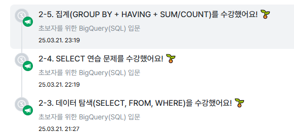

##  2-3 데이터 탐색 : 조건과 추출 (SELECT, FROM, WHERE)

*SELECT*  
  Col1 AS new_name (별칭),     
Col2,   
Col3  
FROM Dataset.Table : 어떤 테이블에서 데이터를 확인할 것인가?   
WHERE : 만약 원하는 조건이 있다면 어떤 조건인가?   
Col1 = 1 : 조건문  

* : 모든 컬럼을 출력하겠다 (비용이 많이 나가서 실무에서는 잘 안쓰임)  

## 데이터가 여러 장소에 저장되어 있는 경우

특정 Table에 있는 데이터를 각각 추출 후  
 연결하기 (추후에 배울 JOIN)

주석 단축키 : *드래그 앤 드랍* 후 커맨드나 컨트롤 누르고 /(슬래쉬) 누르면 주석이 됨 

* EXCEPT(칼럼) : 해당 칼럼을 제외한 나머지 칼럼 
 
 *AS 사용시 컬럼 이름에 따옴표 NO* 

 핵심 정리)

 FROM :   
 1.  데이터를 확인할 Table 명시
 2.   이름이 너무 길다면 AS   '별칭'으로 지정 ex) *FROM   Table1 AS t1*

 WHERE :  
 1. FROM에 명시된 Table에 저장된  
 데이터를 필터링(조건 설정)  

  2. Table에 있는 컬럼을 조건 설정 

 SELECT : 
 1. Table에 저장되어 있는 컬럼 선택  

 2.  여러 컬럼 명시 가능
 (별칭 지정 가능)

####  쿼리 *실행* 순서 
 1.FROM 2. WHERE 3. SELECT 

## 2-4 SELECT 연습 문제 (내용 생략)

name, age, hometown ==> 영어로 명시되어 있는 경우엔 편함.  
하지만 현업에서는 '이름, 나이를 알려주세요' 라는 식으로 요청  
==> 컬럼의 의미를 파악해서 작성해야함 
==> 어떤 컬럼을 요구하는지, 어떤 컬럼을 봐야하는지 ?

## 2-5 집계(GROUP BY + HAVING + SUM/COUNT)

  *GROUP BY* : 같은 값끼리 모아서 그룹화한다 EX) '타입'을 기준으로 그룹화해서 '평균 공격력', '타입 별 포켓몬 수' 등을 집계  

ORDER BY : 정렬도 가능(내림,오름차순)  

HAVING : 그룹화 한 값에 조건 설정,  
집계할 컬럼을 SELECT에 명시하고 그 컬럼을 꼭 GROUP BY에 작성  

 DISTINCT : 고유값을 알고 싶은 경우(중복을 제거함)  

 SELECT   
  집계할 컬럼,   
  COUNT(DISTINCT count할 컬럼)  
  FROM table  
  GROUPY BY 
  집계할 컬럼 

  ### (연습문제 생략) 

## 그룹화(집계) 활용 포인트

테이터 분석하다가 그룹화하는 경우 예시 
- 일자별 집계 (원본 데이터는 특정 시간에 어떤 유저가 한 행동이 기록, 일자별로 집계)

- 연령대별 집계(특정 연령대에서 더 많이 구매했는가?)
- 특정 타입별 집계(특정 제품 타입을 많이 구매했는가?)
- 앱 화면별 집계(어떤 화면에 유저가 많이 접근했는가?) 
## WHERE 과 HAVING의 차이

- WHERE:   
Table에 바로 조건을 설정하고 싶은 경우 사용 

- HAVING:  
GROUP BY 한 후 조건을 설정하고 싶은 경우 사용 

## 서브쿼리

- SELECT 문 안에 존재하는 SELECT 쿼리
- FROM 절에 또 다른 SELECT 문을 넣을 수 있음 
- 괄호로 묶어서 사용 

서브쿼리를 작성하고, 서브 쿼리 바깥에서 WHERE 조건 설정하는 것 = 서브 쿼리에서 HAVING으로 하는 것 

## 정렬하기 : ORDER BY 

- ORDER BY는 쿼리 맨 마지막(아래)에 두고, 쿼리의 맨 마지막에만 작성하면 됨 (중간에 필요없음)

# 출력 개수 제한하기 : LIMIT

- 쿼리문의 결과 row수를 제한하고 싶은 경우 LIMIT 사용 
- 쿼리문의 제일 마지막에 작성 

# 연습문제 

포켓몬의 수를 타입별로 집계하고,  
 포켓몬의 수가  이상인 타입만 남기는 쿼리를 작성해주세요. 포켓몬의 수가 많은 순으로 정렬해주세요. 

SELECT   
type1,
COUNT(id)  
FROM basic.pokemon  
GROUP BY type1  
HAVING COUNT(id) >= 10  
ORDER BY COUNT(id) DESC;

